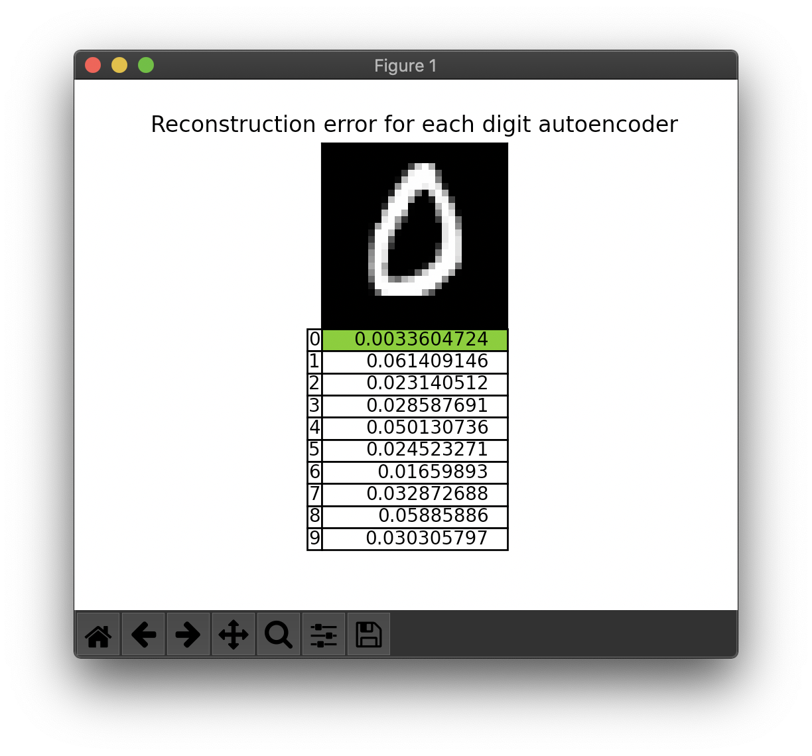
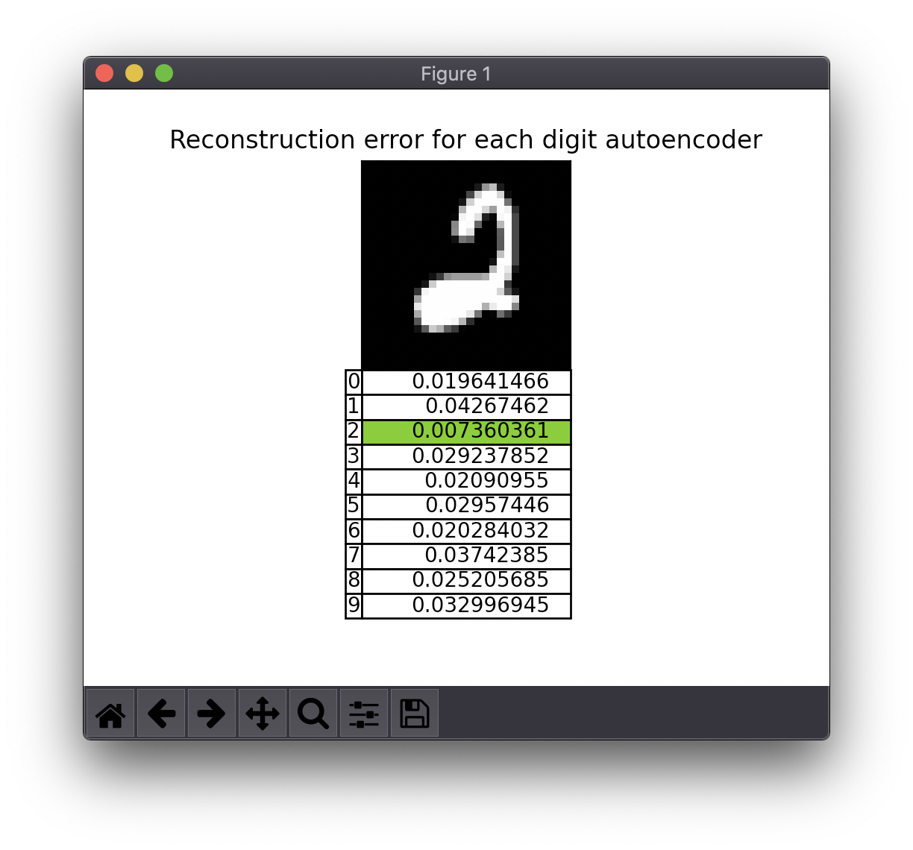
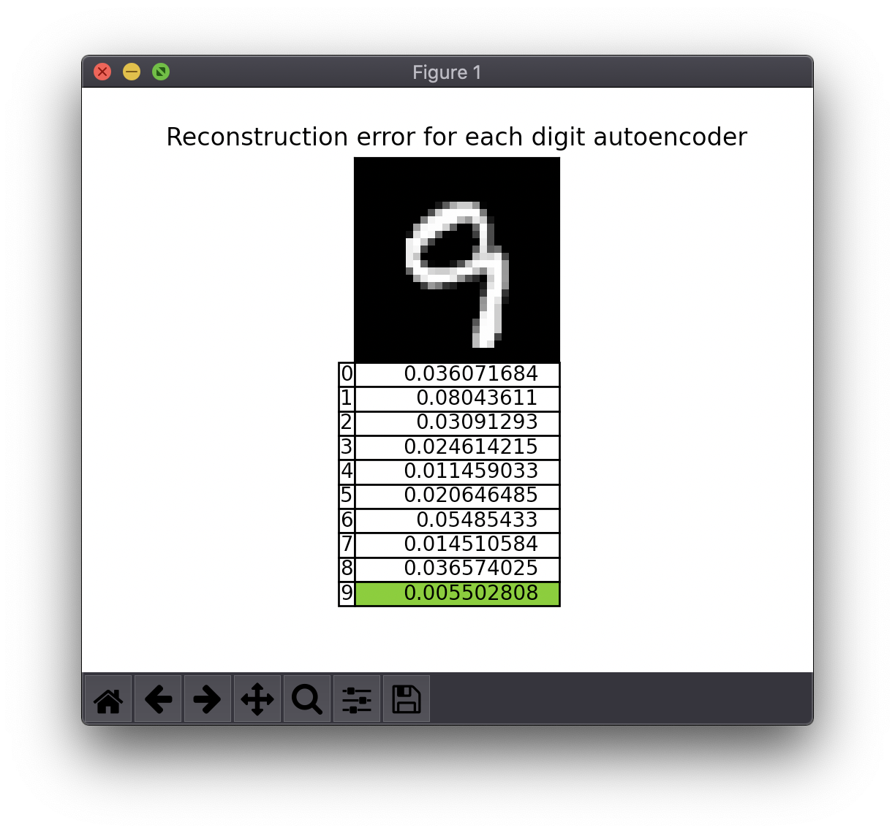

# MnistAutoencodersClassifier

## MNIST dataset classification using autoencoders

This method consists in training a reconstruction autoencoder for each of the 10 classes in MNIST.

Then at inference time, the image is sent to the 10 autoencoders and the example is labeled according to the autoencoder with the smallest reconstruction error.

## How to Run

Install TensorFlow 2.x and Matplotlib into your environment:

```bash
pip install tensorflow
pip install matplotlib
```

Then run:

```bash
python main.py
```

This repository **contains** the 10 trained models and should run in inference mode by default. If the models are deleted the script will retrain them automatically.

## Examples



